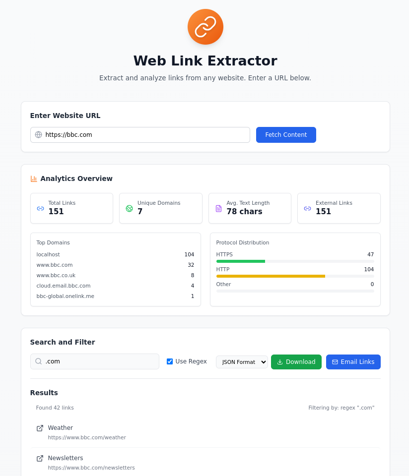

# Web Link Extractor

 [](https://www.typescriptlang.org/)  [](https://reactjs.org/)  [](https://tailwindcss.com/)  [](https://vitejs.dev/)  [](https://nodejs.org/)  [](https://www.docker.com/)  [](https://eslint.org/)  [](https://cheerio.js.org/)

A modern web application for extracting, analyzing, and managing links from any website.

## Features

- Extract links from any website URL
- Comprehensive link analytics
- Advanced search with regex support
- Export links to CSV or JSON
- Email sharing capability
- Responsive design



## Quick Start

```bash
git clone https://github.com/yourusername/web-link-extractor.git
cd web-link-extractor
npm install
npm run dev
```

## Prerequisites

### Required

- Node.js 18+
- TypeScript 5.5+
- React 18.3+
- Vite 5.4+

### Optional

- Docker (for email functionality)

### Development Tools

- ESLint 9+
- Tailwind CSS 3.4+
- Cheerio 1.0.0-rc.12

## Development Setup

1. Clone and install:

```bash
git clone https://github.com/yourusername/web-link-extractor.git
cd web-link-extractor
npm install
```

2. Start development:

```bash
npm run dev
```

## Available Scripts

- `npm run dev` - Start development server
- `npm run build` - Build for production
- `npm run preview` - Preview production build
- `npm run lint` - Lint code

## Creator

Ed Bates (TECHBLIP LLC)

## Acknowledgments

Some sections of this code were generated with the assistance of AI tools.  These contributions were reviewed and integrated by the project creator(s).

## TODO

- **Fix domain name issue**: The app is returning "localhost" instead of the real domain name in some cases.

## License

Apache-2.0 license - see the [LICENSE](LICENSE) file for details
